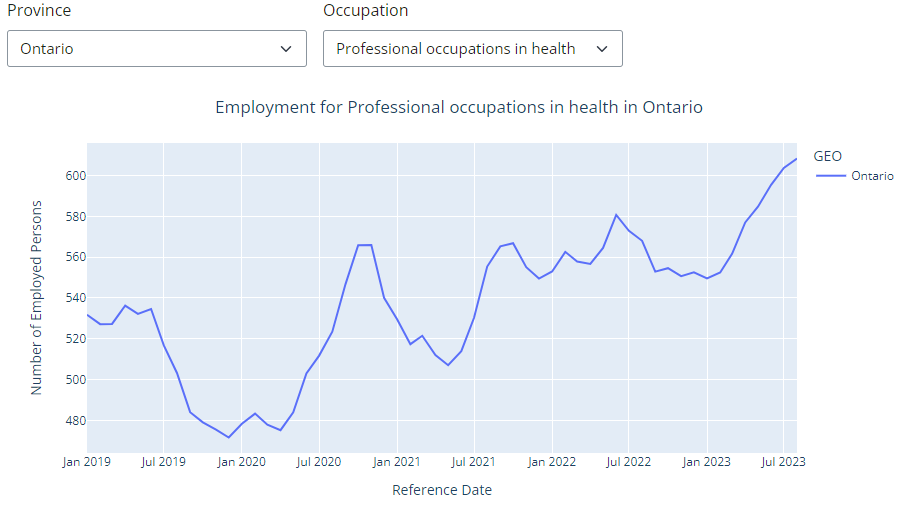
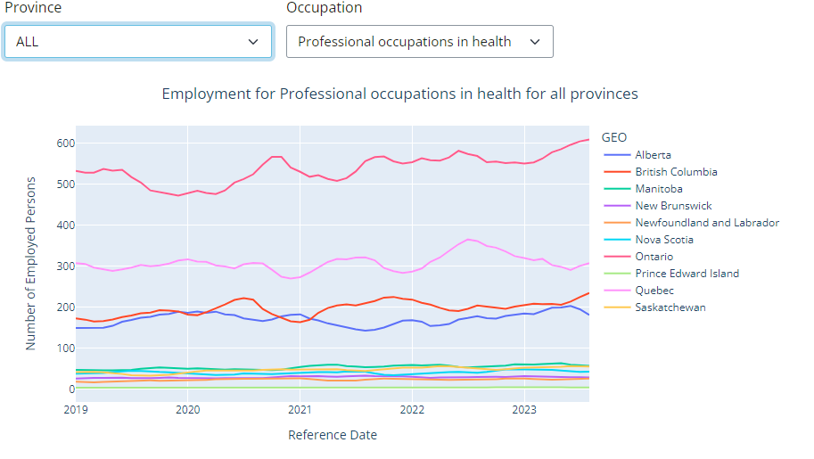

## Employment Trend Analysis

### Introduction
This report visualizes employment trends in Canada and its provinces from August 2019 till August 2023. The report shows that employment rates not only recovered since the pandemic but exceeded pre-pandemic rates.

The report uses the dataset ”Employment by occupation, economic regions, three-month moving average, unadjusted for seasonality" published by Statistics Canada. The data is retrieved from the Canadian Open Government Portal Website.

### Content
1. **EDA Notebook:** Contains the whole data pipeline including data exploration, data transoformation, data cleaning and analysis, and data visualization.

2. **Shiny App:** Contains the code for the deployed Shiny App used for interactive visualization of the employment trends.

### Shiny App

Through the Application, users can choose to display the employment trend for a choosen occupation in a single provinance or for all provinances.

#### Sample Output

